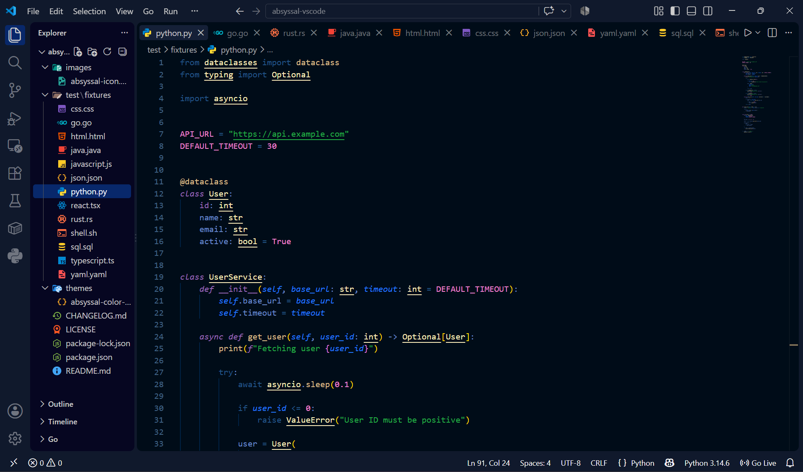
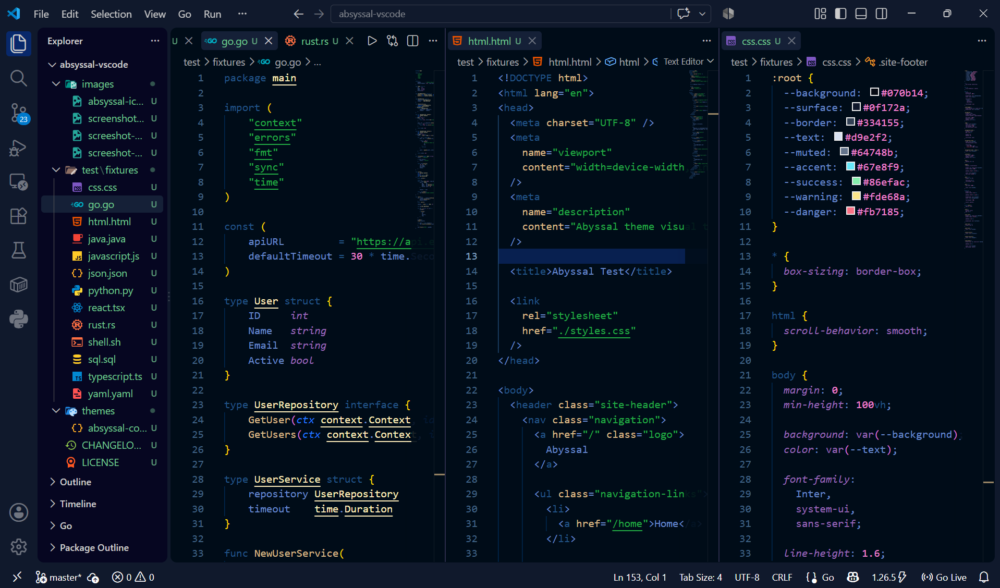
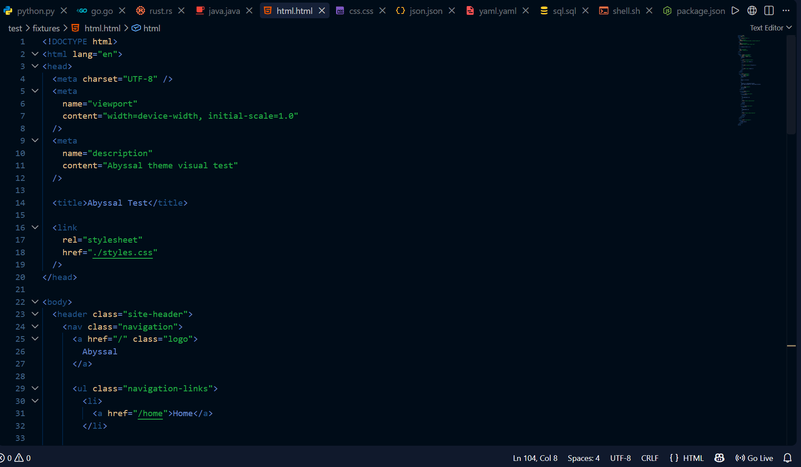

# Abyssal

A deep, low-noise dark theme designed for developers who spend hours in their editor.

Abyssal uses layered dark surfaces, restrained borders, and semantic syntax colors to keep your code readable without visual noise.

> Your editor should disappear while your code stays visible.

---

## Philosophy

Abyssal is built around one idea:

**Your editor should disappear while your code stays visible.**

Most dark themes try to make the editor visually exciting.

Abyssal takes the opposite approach.

The interface stays quiet. Syntax gets a clear hierarchy. Important states receive focused accents. Nothing should compete with the code you're working on.

### Design principles

- Deep layered surfaces
- Low visual noise
- Strong syntax hierarchy
- Focus-driven cyan accents
- Subtle borders
- Comfortable contrast
- Git-aware colors
- Terminal-aware palette
- Long-session readability
- Consistent cross-language highlighting

---

## Color System

Abyssal uses a restrained semantic color system.

| Role | Color |
| --- | --- |
| Editor | `#070B14` |
| Primary text | `#F1F5F9` |
| Focus | `#67E8F9` |
| Functions | `#C4B5FD` |
| Types | `#67E8F9` |
| Classes | `#A5B4FC` |
| Strings | `#86EFAC` |
| Numbers | `#FDE68A` |
| Constants | `#F0ABFC` |
| Errors | `#FB7185` |

The goal isn't to use as many colors as possible.

The goal is to give each important semantic category a recognizable visual role.

---

## Installation

### VS Code Marketplace

Search for:

**Abyssal**

in the VS Code Extensions Marketplace.

Then:

1. Open Extensions in VS Code.
2. Search for `Abyssal`.
3. Select the theme.
4. Click **Install**.
5. Open the Color Theme selector.
6. Select **Abyssal**.

### VSIX

You can also install Abyssal manually using a `.vsix` package.

In VS Code:

```text
Ctrl + Shift + P
````

Then run:

```text
Extensions: Install from VSIX...
```

Select the Abyssal `.vsix` file.

---

## Recommended Settings

Abyssal works well with the default VS Code experience.

For the intended visual experience, we recommend:

* Semantic highlighting enabled
* Standard VS Code font rendering
* Default editor antialiasing
* Minimap enabled or disabled according to preference

Abyssal does not require a specific programming font.

Use the font you are most comfortable coding with.

---

## Supported Languages

Abyssal provides syntax and semantic highlighting across common development environments, including:

* TypeScript
* JavaScript
* TSX / React
* Python
* Go
* Rust
* Java
* C++
* C#
* HTML
* CSS
* JSON
* YAML
* SQL
* Shell
* Markdown

The theme is designed to maintain a consistent visual hierarchy across languages rather than assigning completely different palettes to each language.

---

## Developer Experience

Abyssal is designed around the parts of VS Code developers interact with every day.

### Editor

* Deep editor background
* Clear primary text
* Focused selection states
* Distinct bracket matching
* Comfortable inactive text
* Low-noise whitespace and punctuation

### Syntax

* Semantic syntax hierarchy
* Distinct functions
* Clear types and classes
* Readable strings
* Visible constants
* Controlled numeric highlighting
* Consistent comments

### Git

Git decorations use dedicated colors for common repository states, including:

* Added lines
* Modified lines
* Deleted lines
* Renamed content
* Untracked files

### Diagnostics

Errors, warnings, information, and hints use dedicated semantic colors so problems are visible without overwhelming the editor.

### Terminal

Abyssal includes a terminal-aware ANSI palette designed to remain readable against the deep editor surfaces.

---

## Visual Testing

Abyssal is tested across multiple programming languages and development environments.

Our visual fixtures cover:

```text
TypeScript
JavaScript
React / TSX
Python
Go
Rust
Java
HTML
CSS
JSON
YAML
SQL
Shell
```

Testing focuses on:

* Syntax hierarchy
* Readability
* Contrast
* Semantic consistency
* Selection states
* Bracket matching
* Diagnostics
* Git decorations
* Terminal colors
* Long-session comfort

---

## Screenshots

### Editor



### Multi-language Support



### Full VS Code Experience



### Terminal and Git


---

## Version

Current release:

**0.1.0**

Abyssal is currently in its early release phase.

The theme will continue to evolve based on real-world usage, visual testing, and developer feedback.

---

## Contributing

Contributions are welcome.

If you find a syntax highlighting issue, contrast problem, or inconsistent UI state, please open an issue with:

* The language or VS Code component
* A screenshot when possible
* The current Abyssal version
* Your VS Code version
* A description of the expected behavior

For larger changes, please open an issue before submitting a pull request so the design direction can be discussed first.

---

## Feedback

Abyssal is designed for developers who spend long hours inside their editor.

If something feels distracting, difficult to read, too bright, or visually inconsistent, that feedback is valuable.

The goal is simple:

> Less noise.
>
> More focus.
>
> Better coding.

---

## License

Abyssal is released under the MIT License.

See [LICENSE](LICENSE) for the full license text.

---

## Author

Created by **Vishnu Kothakapu**.

---

**Abyssal**

*Designed to disappear. Built to keep you focused.*

